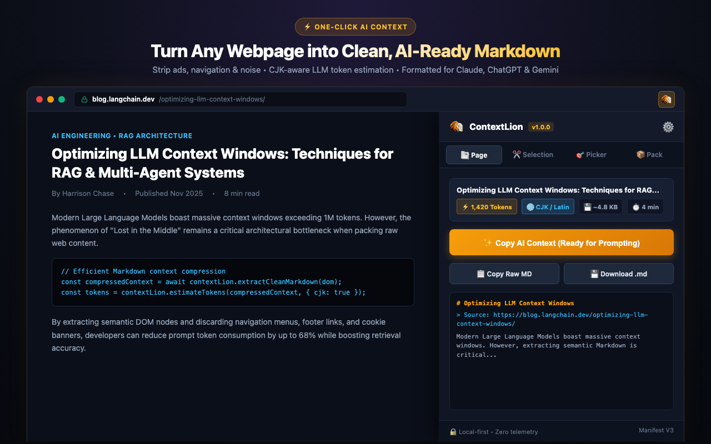
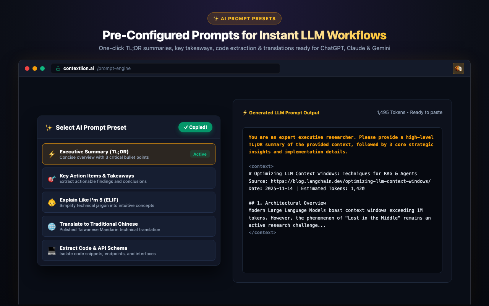
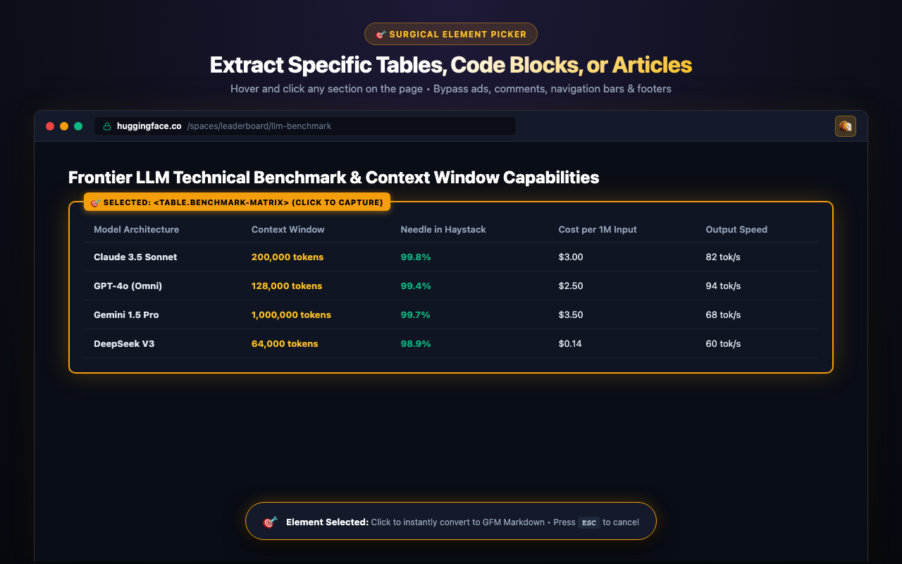
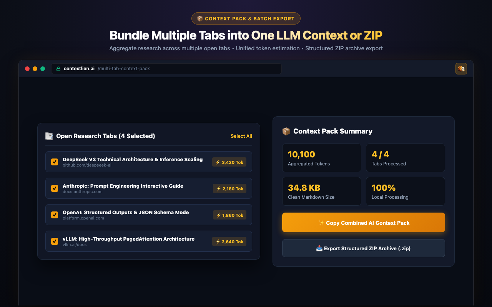
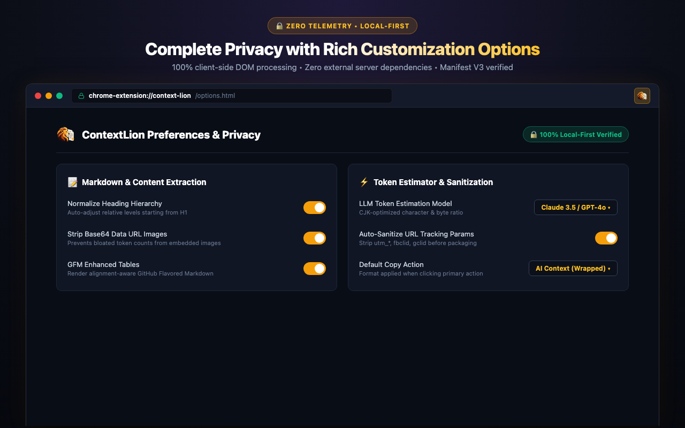

# ContextLion 🦁

<p align="center">
  
</p>

<p align="center">
  <strong>一鍵將任何網頁轉為乾淨、結構化、AI 就緒的 GFM Markdown 脈絡！</strong><br />
  自動去廣告與雜訊 • CJK 語系 Token 即時估算 • 內建 AI 提示詞模板 • 100% 本地運算零追蹤
</p>

<p align="center">
  <a href="README.md">English</a> | <a href="README.zh-TW.md">繁體中文</a>
</p>

<p align="center">
  <a href="https://opensource.org/licenses/MIT"></a>
  <a href="https://developer.chrome.com/docs/extensions/mv3/intro/"></a>
  <a href="https://wxt.dev/"></a>
  
  
</p>

<p align="center">
  
</p>

---

## 🤔 為什麼你需要 ContextLion？

在日常使用 **Claude、ChatGPT、Gemini、DeepSeek** 或 **Cursor** 時，我們經常需要餵給 AI 網頁文章、技術文件或新聞作為參考脈絡。

| ❌ 傳統直接反白複製的痛點 | ✅ 使用 ContextLion 的極致體驗 |
| :--- | :--- |
| 夾帶大量**導覽列、頁尾連結、廣告橫幅與 Cookie 彈窗** | **智慧淨化核心文章**，徹底剔除無關元件，只留乾淨內文 |
| 肥大的 Base64 圖片編碼一口氣吃掉數萬 Token | **自動剝除 Base64 內嵌圖片**，大幅節省 AI 視窗容量與費用 |
| 雜訊引發「迷失在中間 (Lost in the Middle)」降低回答品質 | **優雅的 GitHub Flavored Markdown**，標題層級自動規範化 |
| 每次貼上都要重複手打「請幫我整理重點...」 | **內建 8 組專業 Prompt Presets**，一鍵包裝好提示詞直接問 |
| 不知道這篇文章有多長，到底會不會爆掉 Context | **CJK 語系感知 Token 估算器**，即時預估繁中/英文字元消耗 |

```text
網頁文章 / 技術文件 ➔ ContextLion 自動去雜訊 ➔ 純淨 Markdown + AI 提示詞 ➔ 直接貼進 Claude / ChatGPT / Gemini
```

---

## ⚡ 30 秒快速上手指南

1. **開啟網頁**：在瀏覽器中瀏覽任意技術文章、論文或新聞。
2. **點擊圖示**：點選瀏覽器右上角的 **ContextLion 🦁** 圖示，擴充功能會自動提取主要內容並轉為 Markdown。
3. **一鍵複製**：點擊 **「✨ 複製 AI 脈絡」**（或選取需要的提示詞模板），直接到 AI 對話框中貼上送出！

---

## 📸 5 大核心功能實機展示

### 1. ⚡ 一鍵文章擷取與 AI 脈絡生成 (One-Click Context)
一鍵將網頁轉換為結構化的 GitHub Flavored Markdown，保留完整程式碼區塊（語法高亮標籤）、表格與引用，並即時顯示字數、大小與 Token 消耗。



---

### 2. ✨ 內建 AI 提示詞模板 (Prompt Presets)
不用每次重複手打指令！內建多種常用專業提示詞，也可以自由新增自訂模板：
- ⚡ **執行摘要 (TL;DR)**：快速抓住文章核心要旨。
- 🎯 **核心重點與待辦 (Key Action Items)**：提取關鍵決策與執行清單。
- 👶 **深入淺出白話解釋 (Explain Like I'm 5)**：將艱澀術語轉為通俗易懂的解釋。
- 🌐 **繁體中文專業翻譯**：精準在地化翻譯。
- 💻 **程式碼與架構提取**：萃取 API 介面、函式規格與架構圖。



---

### 3. 🎯 外科手術式視覺元素選取器 (Precision Element Picker)
遇到長篇網頁只需要其中的一個比較表格、一段程式碼或一則評論？
開啟元素選取模式，滑鼠移至任意區塊會亮起金色選取框，點擊即可局部精準擷取，完全不受頁面其他雜訊干擾！



---

### 4. 📦 多分頁脈絡打包與批次 ZIP 匯出 (Context Pack)
進行深度研究時通常會開啟多個分頁。ContextLion 支援一鍵讀取當前視窗的所有分頁，自動依網域分組：
- **即時聚合 Token**：勾選想要的分頁，即時統計所有文章合併的 Token 總數。
- **一鍵合併複製**：將多篇文章打包成單一格式統一的 AI 脈絡。
- **批次匯出 ZIP**：無須後端伺服器，本地直接生成標準 `.zip` 壓縮檔，內含 `README.md`、`all-sources-combined.md` 與獨立編號的 Markdown 文章。



---

### 5. 🔒 100% 本地運算與個人化設定 (Local-First & Settings)
- **100% Client-Side**：所有 DOM 清洗、Markdown 轉換與 Token 計算都在您的電腦瀏覽器本地執行。
- **零隱私追蹤**：無後端伺服器、無任何資料上傳、無 Google Analytics 或第三方追蹤。
- **豐富自訂選項**：可自訂標題層級自動校正、Base64 圖片過濾、URL 追蹤參數自動淨化（去除 `utm_*`、`fbclid`）與 Token 估算模型比例。



---

## 🤖 完美支援主流 AI 工具生態

- **對話模型**：Claude 3.5 Sonnet / Opus、ChatGPT (GPT-4o / o1 / o3)、Google Gemini 1.5 / 2.0 Pro、DeepSeek V3 / R1
- **AI 編輯器**：Cursor、GitHub Copilot、Windsurf
- **筆記與知識庫**：Obsidian、Notion、Logseq、NotebookLM

---

## 🔒 權限與安全承諾

ContextLion 恪守 **最小權限原則 (Principle of Least Privilege)**，絕不胡亂申請危險權限：

| 權限項目 | 用途說明 |
| :--- | :--- |
| `activeTab` | 僅在您**主動點選**擴充功能圖示或選取器時讀取當前頁面，絕不在背景常駐監聽。 |
| `scripting` | 僅在您點擊擷取時，將本地解析腳本注入當前頁面提取純淨文字。 |
| `storage` | 在本機儲存您的個人偏好設定（外觀、格式、自訂 Prompt）與歷史紀錄。 |
| `unlimitedStorage` | 確保本機儲存的歷史紀錄不會因超過瀏覽器 5MB 配額上限而遺失。 |
| `tabs` | 僅用於「多分頁 Context Pack 打包」時讀取分頁標題與網址供您勾選。 |

> 🛡️ **絕不申請 `<all_urls>` 全網域權限**，沒有您的點擊授權，擴充功能無法主動讀取任何網頁。詳細請參閱 [PRIVACY.md](PRIVACY.md)。

---

## 🏗️ 系統運作架構

```text
瀏覽器分頁 (Web Tab)
   │
   ▼ [使用者主動點擊]
DOM Extractor (document.cloneNode 安全副本)
   │
   ▼
Content Cleaner (過濾 scripts、樣式、廣告、導覽與頁尾)
   │
   ▼
Mozilla Readability (提取核心文章結構)
   │
   ▼
Turndown + GFM Plugin (轉為高品質 GitHub Flavored Markdown)
   │
   ▼
Token Estimator (CJK + 歐語加權估算) + Prompt Presets (套用 AI 提示詞)
   │
   ▼
一鍵複製至剪貼簿 (Clipboard) 或本機下載 (.md / .zip)
```

---

## 🚀 開發者指南 (Developer Guide)

### 前置需求
- [Node.js](https://nodejs.org/) (v20+)
- [pnpm](https://pnpm.io/) (v9+)

### 本地安裝與開發

```bash
# 複製儲存庫
git clone https://github.com/malilion/context-lion.git
cd context-lion

# 安裝相依套件
pnpm install

# 啟動 Chrome 熱重載開發模式 (Hot-Reload)
pnpm dev
```

在 Chrome 瀏覽器開啟 `chrome://extensions`：
1. 開啟右上角 **「開發者模式」**。
2. 點選左上角 **「載入未封裝項目」**。
3. 選取專案中的 `.output/chrome-mv3` 目錄即可測試！

### 建置與打包發行

```bash
# 編譯 TypeScript 型別檢查
pnpm compile

# 執行單元測試 (Vitest 63/63 測試)
pnpm test

# 程式碼風格規範檢查 (ESLint)
pnpm lint

# 打包 Chrome MV3 生產版本 ZIP 檔
pnpm build && pnpm zip
# 產出檔案位於：.output/context-lion-1.0.0-chrome.zip
```

---

## 📄 開源授權

本專案採用 [MIT 授權條款](LICENSE) 開源發布。
由 **Malilion Browser Tools** 團隊精心打造。
