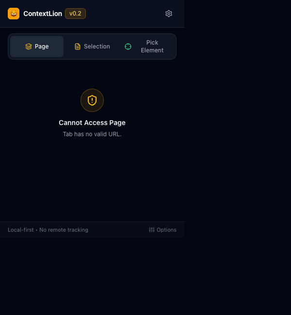

# ContextLion 🦁

> **將任何網頁一鍵轉換為乾淨、結構化、AI 就緒的 Markdown 脈絡。**

[English](README.md) | [繁體中文](README.zh-TW.md)

[](https://github.com/malilion/context-lion/actions/workflows/ci.yml)
[](https://opensource.org/licenses/MIT)
[](https://developer.chrome.com/docs/extensions/mv3/intro/)
[](https://wxt.dev/)

ContextLion 是一款專為開發者、研究人員與 AI 工作者打造的開源瀏覽器擴充功能。它能高保真度擷取文章、技術文件與長篇網頁內容，自動剔除導覽列、廣告、Cookie 橫幅與無關雜訊，將純淨的內文轉換為結構化的 Markdown 格式，讓你能直接貼入 ChatGPT、Claude、Gemini 或 Codex 中作為優質上下文。

```text
網頁文章 → ContextLion → 純淨結構化 Markdown → ChatGPT / Claude / Gemini / Codex
```

<p align="center">
  
</p>

---

## ✨ 核心特色 (v1.0.0)

- **智慧內容擷取**：基於 Mozilla Readability 於複製的 DOM 樹（`document.cloneNode(true)`）上執行，安全提取主要文章內容而不干擾網頁原始運行狀態。
- **多元擷取模式**：
  - **全頁擷取 (Page)**：高保真度文章與技術文件擷取。
  - **文字選取擷取 (Select)**：滑鼠反白任意段落或程式碼，一鍵直接轉為 Markdown。
  - **視覺化區塊選取 (Pick)**：滑鼠懸浮高亮並點選網頁特定區塊進行局部精準擷取。
  - **📦 Context Pack (多分頁合併擷取)**：在當前視窗中選取多個分頁（自動依網域分組），一鍵打包整合成單一 AI 就緒的脈絡文件。
- **URL 正規化與重複抑制 (`normalizeUrl`)**：自動清除追蹤參數（`utm_*`、`fbclid`、`gclid` 等）與錨點 hash，防止多個分頁重複擷取相同文章。
- **容錯循序批次擷取引擎**：具備即時動態進度條。若單一分頁關閉或失敗，自動記錄錯誤預留位置並繼續處理剩餘分頁，不中斷整批作業。
- **純 TypeScript 結構化 ZIP 匯出**：無外部依賴，直接產生標準 PKZIP 封裝檔，內含 `README.md`、`all-sources-combined.md` 與各分頁獨立來源檔（`sources/01-標題.md`）。
- **Context 歷史紀錄與收藏 (History & Collections)**：Popup 內建抽屜式側邊欄與專屬 Options 設定頁，支援一鍵複製、星號收藏與個別/批次清除。
- **Prompt Presets 任務指示庫**：內建 8 組專業 Prompt 範本（_Summarize、Explain、Technical Analysis、Create Notes、Code Review、Research Context_ 等），並支援自訂專屬任務提示詞。
- **標題階層正規化 (Heading Normalization)**：等比縮放內文標題深度，使最高層級標題維持為 `##`，將 `#` 專屬保留給文件主標題（嚴格保護程式碼區塊內的註解不被變更）。
- **高保真 Markdown 轉換**：
  - 完整保留程式碼區塊（Fenced Code Blocks）及其語言標籤（`pre > code.language-*`）。
  - 自動轉換 HTML 表格為標準 GitHub Flavored Markdown (GFM) 表格。
  - 保留超連結與圖片替代文字（Alt text）。
- **CJK 語系 Token 智慧估算**：針對中文/日文/韓文（約 1.2 tokens/字）與英歐語系（約 4 字元/token）進行加權估算，即時顯示字數、詞數與 Token 數。
- **100% 本地運算與零遙測 (Local-First & Zero Telemetry)**：所有資料處理與轉換皆在瀏覽器本地完成，無遠端伺服器、無追蹤分析、無外部 API。

---

## 🔒 權限與隱私安全

ContextLion 嚴格恪守**最小權限原則 (Principle of Least Privilege)** 與 Chrome 線上應用程式商店的單一用途規範 (Single Purpose Policy)：

| 權限項目    | 用途說明                                                                                     |
| ----------- | -------------------------------------------------------------------------------------------- |
| `activeTab` | 僅在使用者主動點選擴充功能按鈕時取得當前頁面閱讀權限，絕不在背景常駐監聽。                   |
| `tabs`      | 讀取當前視窗的分頁標題與網址，用以進行域名分組與多選 Context Pack 合併（絕不外傳歷史紀錄）。 |
| `scripting` | 僅在使用者請求時，將本地內容擷取腳本注入至選定分頁中提取乾淨內文。                           |
| `storage`   | 使用 `storage.sync` 儲存介面偏好設定，使用 `storage.local` 儲存本地脈絡歷史紀錄。            |

> **絕不申請 `<all_urls>` 廣泛主機權限。** ContextLion 在未經使用者主動點擊觸發前，無法在背景讀取任何網頁。

詳細政策請參閱 [PRIVACY.md](PRIVACY.md) 與 [SECURITY.md](SECURITY.md)。

---

## 🏗️ 系統架構

```text
Popup（使用者開啟介面並操作）
   ↓ chrome.scripting.executeScript（經由 activeTab / tabs 手勢授權）
Extractor Script（注入至目標分頁）
   ↓ DOM Extractor（document.cloneNode(true) 建立安全副本）
   ↓ Content Cleaner（過濾 scripts、樣式、廣告、導覽與頁尾）
   ↓ Readability Parser（解析主要文章結構）
   ↓ 回傳結構化資料 RawExtraction { metadata, contentHtml, textContent }
Popup Context
   ↓ TurndownService + turndown-plugin-gfm（轉換為 Markdown）
   ↓ Heading Normalizer + Prompt Formatter
   ↓ Token Estimator（CJK + 歐語加權估算）
   ↓ 剪貼簿複製 (Clipboard API) 或 Blob 本地下載 (.md / .txt / .zip)
```

- **職責分離**：分頁腳本只負責安全提取純淨 HTML 與詮釋資料；Markdown 轉換、Token 估算與檔案匯出均在 Popup 環境以純函式執行，易於測試且不汙染網頁環境。
- **MV3 最佳實踐**：由於 Service Worker 無法存取 DOM 與 `URL.createObjectURL`，所有剪貼簿寫入與檔案下載皆於 Popup 上下文中完成。

---

## 🚀 快速上手

### 前置需求

- [Node.js](https://nodejs.org/) (v20+)
- [pnpm](https://pnpm.io/) (v9+)

### 安裝專案

```bash
# 複製儲存庫
git clone https://github.com/malilion/context-lion.git
cd context-lion

# 安裝相依套件
pnpm install
```

### 本地開發

```bash
# 啟動 Chrome 熱重載開發模式
pnpm dev

# 啟動 Firefox 開發模式
pnpm dev:firefox
```

於瀏覽器開啟 `chrome://extensions`，啟用右上角「**開發者模式**」，點選「**載入未封裝項目**」，選擇專案中的 `.output/chrome-mv3` 目錄。

### 建置正式發行版本

```bash
# 建置 Chrome MV3 生產版本
pnpm build

# 建置 Firefox MV3 生產版本
pnpm build:firefox

# 打包發行用 ZIP 壓縮檔
pnpm zip
pnpm zip:firefox
```

---

## 🧪 測試與驗證

```bash
# 執行 Vitest 單元測試
pnpm test

# 執行 TypeScript 型別檢查
pnpm compile

# 執行程式碼規範與排版檢查
pnpm lint
pnpm format -- --check

# 執行 Playwright 端到端測試 (持久化 Chromium 環境)
pnpm test:e2e
```

---

## 🗺️ 開發里程碑

- **v0.1.0 (MVP)**：當前頁面擷取、Markdown 轉換、AI Context 標頭格式化、本地複製與下載。
- **v0.2.0 (V1)**：視覺化元素選取器、文字反白快速擷取、語言自動偵測、Prompt Presets 範本庫、標題階層正規化、獨立 Options 頁面。
- **v1.0.0 (V2)**：**Context Pack 多分頁合併擷取**、URL 正規化去重、容錯循序批次引擎、純 TS ZIP 匯出、本地 History & Collections 收藏系統。

---

## 🤝 參與貢獻

歡迎提交 Pull Request、回報 Bug 或提供新功能建議！請參閱 [CONTRIBUTING.md](CONTRIBUTING.md)。

---

## 📄 開源授權

ContextLion 採用 [MIT 授權條款](LICENSE) 開源發布。
為 **Malilion Browser Tools** 生態系成員。
